# QueueCTL

<p align="center">
  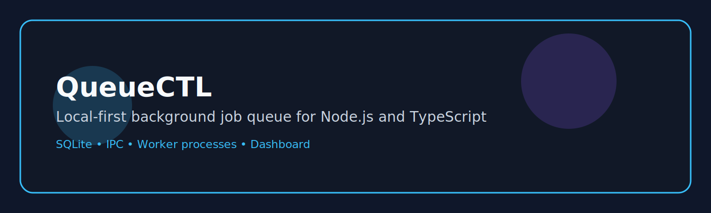
</p>

[](https://nodejs.org/)
[](https://www.typescriptlang.org/)
[](https://www.sqlite.org/)
[](https://vitest.dev/)
[](LICENSE)
[](https://github.com/)
[](https://flam-software-intern-project-production.up.railway.app)
[](docs/USER_GUIDE.md)
[](docs/ARCHITECTURE.md)
[](https://codespaces.new/shaurya1606/flam-software-intern-project)


QueueCTL is a lightweight background job queue for Node.js built around a persistent SQLite backend and a long-running daemon.

It provides durable job execution, worker management, retries, dead-letter queues and runtime inspection through both a CLI and a lightweight dashboard.

> QueueCTL is not a distributed queue system. It is a compact, implementation-friendly queue for local development, automation, and learning about job orchestration without introducing a large infrastructure stack.

## 🚀 Try QueueCTL in your Browser

[](https://codespaces.new/shaurya1606/flam-software-intern-project)

## Why QueueCTL exists

QueueCTL was built to make background work visible and inspectable without depending on a separate broker or cloud service. The implementation focuses on three things:

- transparent state transitions for each job
- local-first persistence with SQLite
- a clear runtime model that is easy to reason about and extend

### 🌐 Live Web Dashboard

**Open QueueCTL Dashboard**

👉 **https://flam-software-intern-project-production.up.railway.app**


or

[Open Live Dashboard](https://flam-software-intern-project-production.up.railway.app)

The hosted dashboard allows you to inspect the running queue without setting up the project locally.

## 📸 Project Preview

### 🌐 Dashboard

<p align="center">
  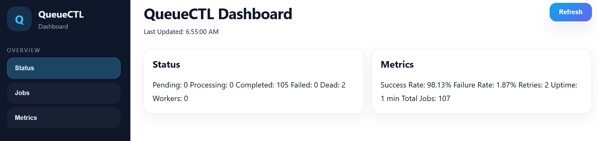
  <br><br>
  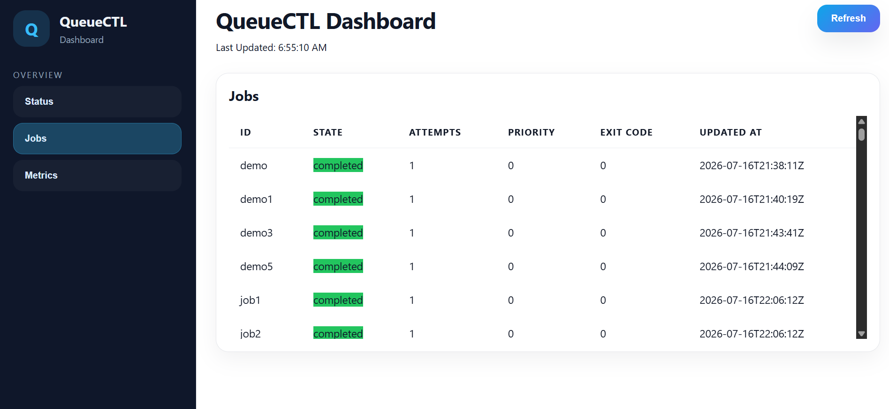
  <br><br>
  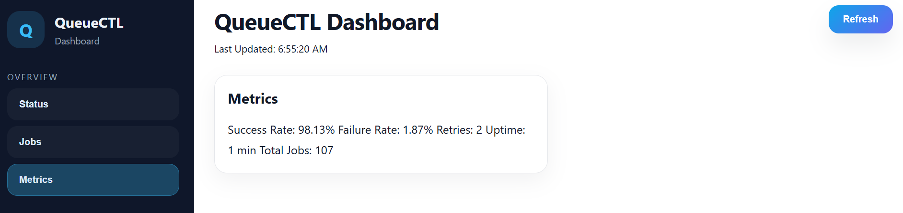
</p>

---

### 💻 CLI

<p align="center">
  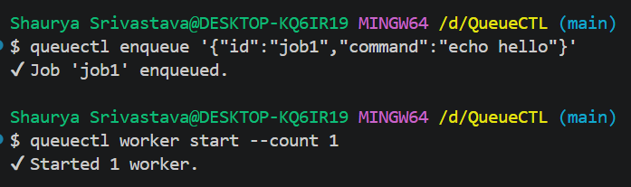
  <br><br>
  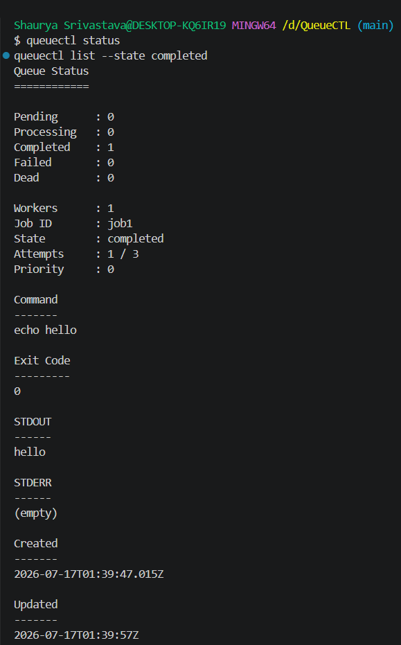
  <br><br>
  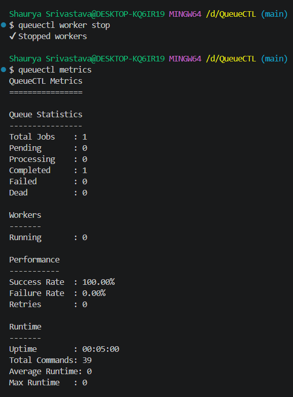
  <br><br>
  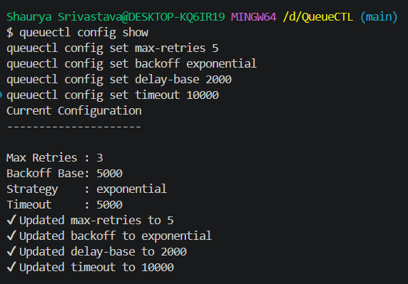
</p>

---

## Features

- ✅ SQLite persistence for jobs, configuration, and metrics
- ✅ Local IPC between CLI, daemon, and dashboard
- ✅ Worker pool with child-process workers
- ✅ Dead-letter queue handling for exhausted retries
- ✅ Retry engine with configurable delay/backoff behavior
- ✅ Metrics and basic runtime statistics
- ✅ Dashboard endpoints for status, jobs, and metrics
- ✅ Configuration system for queue behavior
- ✅ Priority-aware job ordering
- ✅ Scheduled execution via run_after timestamps

  ## 🛠 Tech Stack

| Layer | Technologies |
|--------|--------------|
| Language | TypeScript |
| Runtime | Node.js |
| Database | SQLite (better-sqlite3) |
| CLI | Commander.js |
| Dashboard | Express.js |
| Testing | Vitest |
| IPC | Unix Socket / Windows Named Pipe |
| Frontend | Html, Css, Javascript |

## Architecture overview

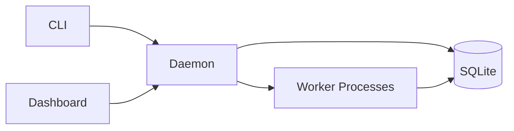

## Request flow

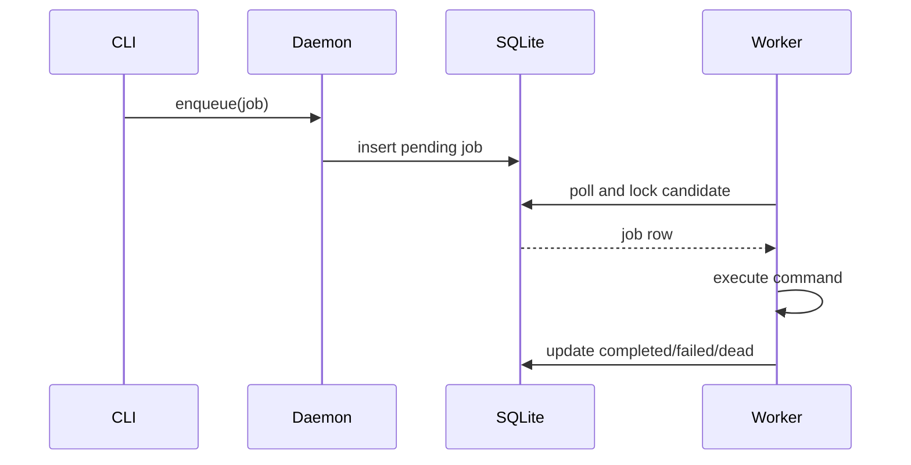

## Job lifecycle

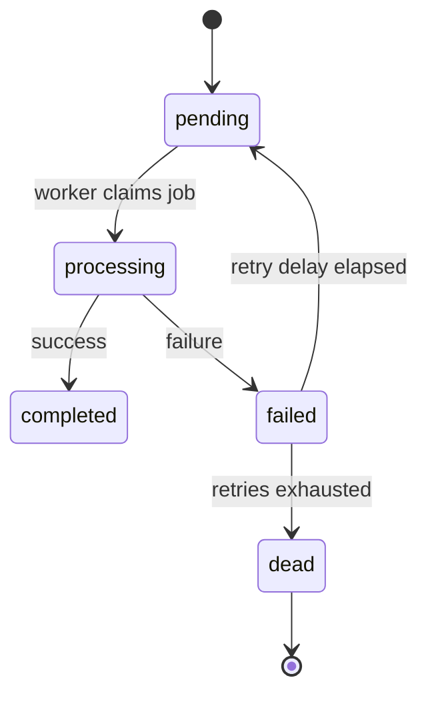

## Repository structure

```text
bin/                      CLI bootstrap entry point
src/cli/commands/         CLI subcommands (enqueue, status, list, worker, metrics, dlq, config)
src/daemon/               daemon and worker entrypoints
src/db/                   SQLite persistence layer
src/lib/                  daemon logic and CLI IPC client
src/type.ts               shared TypeScript types
Dashboard/                Express dashboard and browser assets
tests/                    integration scenarios against a real daemon
```

### Major directories

- [bin](bin) — the Node entry point that registers the CLI commands.
- [src/cli/commands](src/cli/commands) — the command modules that map CLI verbs to daemon requests.
- [src/daemon](src/daemon) — the long-running daemon and worker implementations.
- [src/db](src/db) — the SQLite schema, initialization code, and query helpers.
- [src/lib](src/lib) — the queue service layer and the CLI-side IPC client.
- [dashboard](dashboard) — the Express server and static assets for the web dashboard.
- [tests](tests) — end-to-end scenario tests that exercise the live daemon and database.

## Quick start

### 1. Install dependencies

```bash
git clone https://github.com/shaurya1606/flam-software-intern-project.git
cd QueueCTL
npm install
npm run build
npm link
```
After installation, start the complete QueueCTL stack (daemon + dashboard):

### 2. Start the daemon

```bash
npm start
```

This starts both:

- QueueCTL Daemon
- Express Dashboard

The dashboard is available at:

http://localhost:8080

### 3. Enqueue a job in another terminal

```bash
queuectl enqueue '{"id":"job1","command":"echo hello"}'
```

Expected output:

```text
✔ Job 'job1' enqueued.
```

### 4. Start a worker

```bash
queuectl worker start --count 1
```

### 5. Inspect the queue

```bash
queuectl status
queuectl list --state completed
```

### 6. Dashboard

```bash
npm start
```

This starts both:

- QueueCTL Daemon
- Express Dashboard

The dashboard is available at:

http://localhost:3000

#### Live Deployment

🌐 https://flam-software-intern-project-production.up.railway.app

or

[Open Live Dashboard](https://flam-software-intern-project-production.up.railway.app)

- /health
- /api/status
- /api/jobs
- /api/metrics

## CLI reference

### Enqueue

```bash
queuectl enqueue '{"id":"job1","command":"echo hello"}'
```

Supported payload fields:

| Field | Required | Type | Description |
| --- | --- | --- | --- |
| id | Yes | string | Unique job identifier |
| command | Yes | string | Shell command executed by a worker |
| priority | No | number | `0` for normal, `1` for high |
| run_after | No | string | ISO timestamp that delays execution |
| timeout | No | number | Per-job timeout in milliseconds |
| max_retries | No | number | Max retries for the job |


## 🚀 Live Demo

## 🚀 Live Demo

The latest deployment is available on Railway.

| Resource | URL |
|----------|-----|
| 🌐 Dashboard | https://flam-software-intern-project-production.up.railway.app |
| ❤️ Health | https://flam-software-intern-project-production.up.railway.app/health |
| 📊 Status API | https://flam-software-intern-project-production.up.railway.app/api/status |
| 📋 Jobs API | https://flam-software-intern-project-production.up.railway.app/api/jobs |
| 📈 Metrics API | https://flam-software-intern-project-production.up.railway.app/api/metrics |

### 🌐 Dashboard

https://flam-software-intern-project-production.up.railway.app

### Available API Endpoints

| Endpoint | Description |
|----------|-------------|
| [/health](https://flam-software-intern-project-production.up.railway.app/health) | Health check | /health |
| [/api/status](https://flam-software-intern-project-production.up.railway.app/api/status) | Queue status | /api/status |
| [/api/jobs](https://flam-software-intern-project-production.up.railway.app/api/jobs) | List all jobs | /api/jobs |
| [/api/metrics](https://flam-software-intern-project-production.up.railway.app/api/metrics) | Runtime metrics | api/metrics |

### Example Requests

```text
GET https://flam-software-intern-project-production.up.railway.app/health
```

```text
GET https://flam-software-intern-project-production.up.railway.app/api/status
```

```text
GET https://flam-software-intern-project-production.up.railway.app/api/jobs
```

```text
GET https://flam-software-intern-project-production.up.railway.app/api/metrics
```

### Status

```bash
queuectl status
```

This reports counts for pending, processing, completed, failed, and dead jobs, plus the active worker count.

### List jobs

```bash
queuectl list --state completed
```

Supported states:

- pending
- processing
- completed
- failed
- dead

### Worker management

```bash
queuectl worker start --count 3
queuectl worker stop
```

The current implementation accepts worker counts from `1` through `128`.

### Metrics

```bash
queuectl metrics
```

The metrics output includes totals, retry counts, worker counts, success/failure rates, uptime, total commands executed, average runtime, and max runtime.

### DLQ operations

```bash
queuectl dlq list
queuectl dlq retry <jobId>
```

A dead job is moved back to the pending state and its attempt count is reset before it becomes eligible to run again.

### Configuration

```bash
queuectl config show
queuectl config set max-retries 5
queuectl config set backoff exponential
queuectl config set delay-base 2000
queuectl config set timeout 10000
```

## Configuration reference

| Key | Type | Default | Description |
| --- | --- | --- | --- |
| max-retries | number | 3 | Maximum retries allowed for a job |
| backoff | string | exponential | Backoff strategy; `fixed` or `exponential` |
| delay-base | number | 5000 | Base delay used for retry backoff in milliseconds |
| timeout | number | 5000 | Per-job execution timeout in milliseconds |

## Environment variables

| Variable | Purpose |
| --- | --- |
| DB_PATH | Overrides the SQLite database path |
| SOCKET_PATH | Overrides the daemon IPC socket path |
| PORT | Overrides the dashboard port |

## Testing

The project uses Vitest for integration coverage.

```bash
npm test
npm run test:coverage
```

The current test suite exercises:

- basic job completion
- priority handling
- retry and dead-letter behavior
- multiple workers
- invalid input handling
- persistence across daemon restart

## Performance notes

QueueCTL favors simplicity and locality over distributed scale.

- SQLite is used for durable job state and low-friction local persistence.
- better-sqlite3 keeps the database access path straightforward and fast for this single-host model.
- IPC over a local socket keeps the CLI and dashboard connected to the same daemon without adding an external transport layer.
- Child processes are used for workers because the runtime already needs a simple, isolated execution boundary for each job.

### Tradeoffs

This design is intentionally local-first. It is well suited to development, experimentation, and small automations, but it does not attempt to provide distributed coordination, remote worker fleets, or multi-host failover.

## Design decisions

The current implementation favors an explicit and inspectable runtime model:

- the daemon owns queue semantics and state transitions
- workers are simple execution agents that poll and claim work
- SQLite is the source of truth for job state and configuration
- the CLI and dashboard are thin clients to the daemon over IPC

That separation makes the system easier to reason about than a single monolithic process while staying small enough to understand quickly.

## Known limitations

The implementation is intentionally modest.

- It is not a distributed queue system.
- Workers are local child processes rather than remote workers.
- The CLI and dashboard are designed for a single host because they rely on a local socket.
- There is no built-in authentication or authorization layer.
- There is no cron-style scheduler; run_after is a single delay timestamp rather than a recurring schedule.

## Future improvements

The following ideas are explicitly outside the current implementation and are not yet implemented:

- remote worker execution
- multi-host clustering
- durable job replay and observability beyond the current metrics surface
- richer dashboard workflows and filtering
- queue backpressure and concurrency controls beyond the current worker count model

## Contributor guide

Contributors should begin with the implementation and tests, then make the smallest change that solves the problem.

1. Reproduce the issue with the existing scenarios.
2. Make a focused change in the daemon, worker, database, or command layer.
3. Add or update tests when runtime behavior changes.
4. Rebuild and verify the full test suite.

For deeper contributor guidance, see [docs/DEVELOPMENT.md](docs/DEVELOPMENT.md).

## Documentation map

- [docs/USER_GUIDE.md](docs/USER_GUIDE.md) — product-facing usage guide
- [docs/ARCHITECTURE.md](docs/ARCHITECTURE.md) — engineering design document
- [docs/DEVELOPMENT.md](docs/DEVELOPMENT.md) — contributor workflow and debugging guide
- [docs/VALIDATION_REPORT.md](docs/VALIDATION_REPORT.md) — feature-by-feature documentation validation

## Verification status

The documentation in this repository is verified against the current source tree and the current test suite. Local verification completed with:

```bash
npm run build
npm test
```
