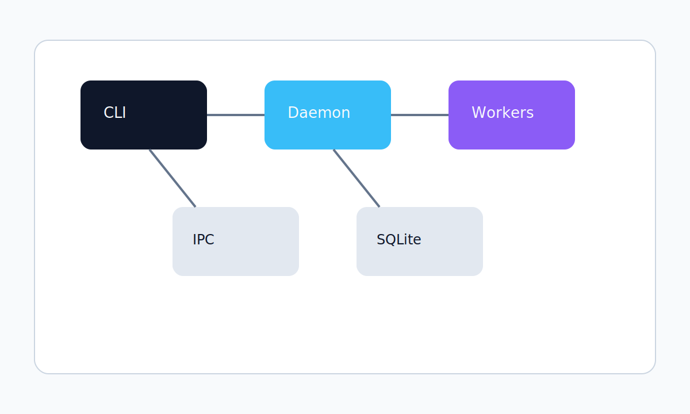
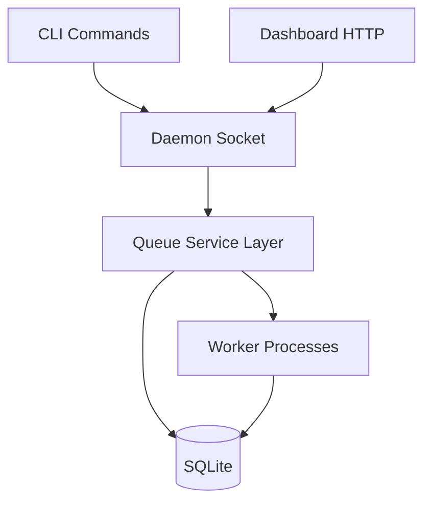
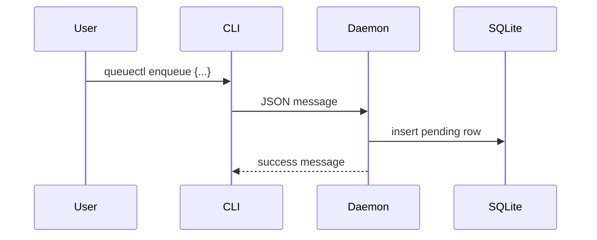
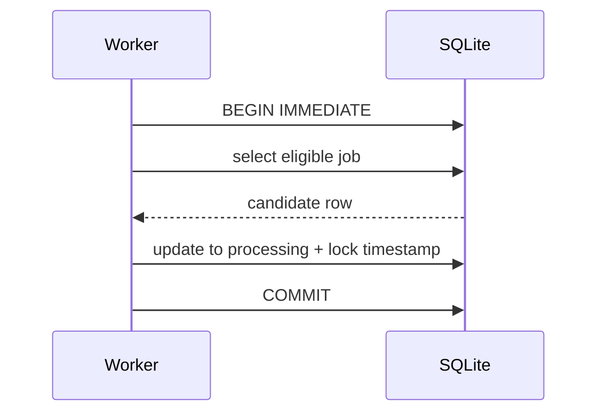
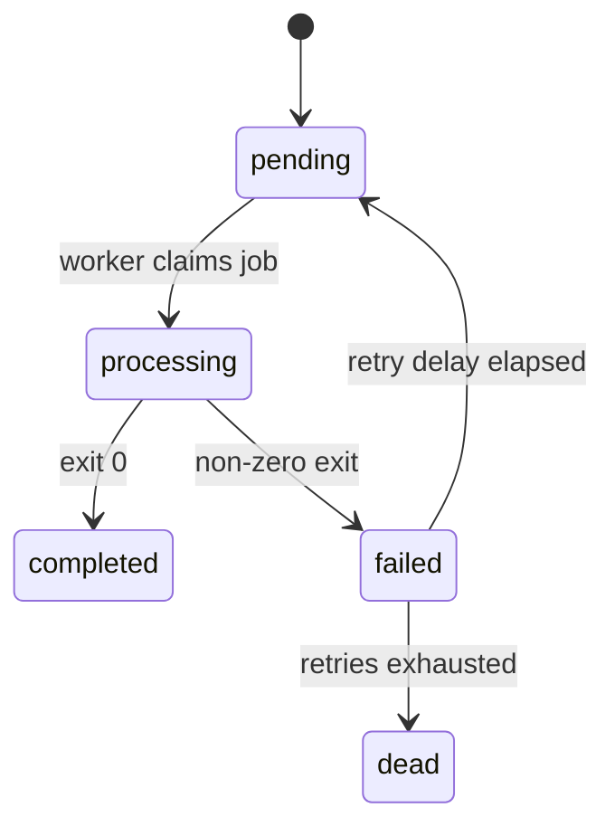
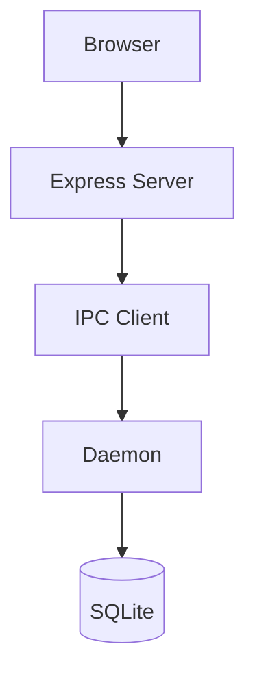

# Architecture

This document is the engineering design reference for the current QueueCTL implementation. It is intentionally implementation-first: every component, lifecycle, and tradeoff described here is grounded in the code under [src](src), [bin](bin), [dashboard](dashboard), and [tests](tests).



## 1. High-level architecture

QueueCTL is composed of four major runtime parts:

1. CLI entry point
2. Daemon process
3. Worker child processes
4. SQLite database

The CLI and dashboard both talk to the daemon over a local IPC socket. The daemon is the authoritative runtime owner for queue semantics, worker coordination, and state transitions.



## 2. Component architecture

### CLI layer

- Entry point: [bin/queuectl.ts](bin/queuectl.ts)
- Command modules: [src/cli/commands](src/cli/commands)
- IPC client: [src/lib/cli.ts](src/lib/cli.ts)

The CLI is intentionally thin. Each command builds a JSON message and sends it to the daemon over the configured socket. The CLI is responsible for input parsing and presentation; the daemon is responsible for queue semantics.

### Daemon layer

- Daemon entry: [src/daemon/daemon.ts](src/daemon/daemon.ts)
- Queue-service logic: [src/lib/daemon.ts](src/lib/daemon.ts)

The daemon performs four roles:

- accepts requests over the local socket
- delegates to queue operations
- tracks worker processes in memory
- shuts down workers on SIGINT or SIGTERM

### Worker layer

- Worker entry: [src/daemon/worker.ts](src/daemon/worker.ts)

Each worker is a Node.js child process. It loops continuously, asks the database for a runnable job, and executes the command using the Node child-process execution API.

### Persistence layer

- Database implementation: [src/db/better-sqlite.ts](src/db/better-sqlite.ts)
- Shared types: [src/type.ts](src/type.ts)

SQLite is used as the durable source of truth for jobs, configuration, and metrics. The database initializes on daemon startup and uses WAL mode.

## 3. Runtime flow

### Enqueue path



The enqueue path validates the payload, resolves runtime defaults from configuration, and inserts a pending row into the jobs table.

### Worker claim path



The worker claims a job by using SQLite transactions and an immediate write lock. The selected row is marked as processing and receives a lock timestamp.

### Completion and retry path

On success:

- the job transitions to completed
- stdout, stderr, and exit code are stored

On failure:

- the job increments attempts
- if attempts are still below the retry limit, the job becomes failed and receives a future run_after timestamp
- if attempts reach the retry limit, the job becomes dead

## 4. State model

The valid job states are defined in [src/type.ts](src/type.ts):

- pending
- processing
- completed
- failed
- dead



## 5. Database schema

### jobs

The jobs table stores the job payload and execution state.

| Column | Purpose |
| --- | --- |
| id | Primary key for the job |
| command | shell command executed by the worker |
| state | current lifecycle state |
| attempts | number of execution attempts |
| max_retries | configured retry threshold |
| created_at | creation timestamp |
| updated_at | last update timestamp |
| locked_at | lease timestamp used by worker claiming |
| timeout | per-job timeout |
| run_after | delayed execution timestamp |
| priority | queue ordering hint |
| started_at | timestamp when processing began |
| stdout | captured output on success or failure |
| stderr | captured error output |
| exit_code | process exit code |

### config

The config table stores queue defaults:

- max-retries
- backoff
- delay-base
- timeout

### metrics

The metrics table stores daemon startup time and cumulative command count.

## 6. IPC protocol

The CLI and dashboard communicate with the daemon over a local socket using plain JSON messaging. The request object is shaped like this:

```json
{
  "command": "enqueue",
  "option": null,
  "flag": null,
  "value": "{\"id\":\"job1\",\"command\":\"echo hello\"}"
}
```

The daemon returns a JSON object containing a success flag and a message payload.

## 7. Worker lifecycle

The worker lifecycle is intentionally simple:

1. The worker process starts.
2. It calls the polling/locking path in the database layer.
3. If an eligible job exists, it transitions it to processing.
4. It executes the command.
5. It updates the row to completed, failed, or dead.
6. It loops again and continues polling.

## 8. Daemon lifecycle

The daemon lifecycle is also straightforward:

1. create the socket server
2. initialize the SQLite schema and metrics
3. begin accepting IPC connections
4. handle requests and dispatch them to queue logic
5. stop workers and close the socket on shutdown

## 9. Retry lifecycle

Retry behavior is handled in the worker path and persists state back into the database.

- the worker increments attempts on failure
- it checks the configured retry limit
- if retries remain, the job is marked failed and given a future run_after timestamp
- if retries are exhausted, the job becomes dead

The current implementation uses a delay base and raises it to the power of the current attempt count, expressed in seconds.

## 10. Locking strategy

QueueCTL uses SQLite transactions and the `BEGIN IMMEDIATE` pattern to reduce simultaneous claims of the same job. The `locked_at` column acts as a lease marker for the worker that currently owns the job.

This makes the current implementation safe enough for local, single-host use and avoids the complexity of a full distributed lock manager.

## 11. Failure recovery

The current failure recovery model is lightweight:

- a worker crash can leave a lock timestamp behind for a while
- the polling logic can still consider the job eligible based on timeout handling
- a job that exhausts retries is moved into the dead state rather than being lost

## 12. Concurrency model

QueueCTL uses a simple concurrency pattern:

- multiple workers can run at once
- the database locking path prevents duplicate claims for the same row
- job ordering is influenced by priority and creation timestamp

## 13. Dashboard architecture



The dashboard is a small Express application in [dashboard/server.js](dashboard/server.js). It serves static files and exposes HTTP endpoints that proxy status, jobs, and metrics requests to the daemon over the same IPC path as the CLI.

## 14. Tradeoff analysis

### Why SQLite

SQLite is a good fit for this project because it keeps persistence local, simple, and inspectable. The tradeoff is that it is not a distributed or horizontally scalable queue backend.

### Why local IPC

The daemon and client processes use a local socket rather than HTTP or a broker. That keeps the runtime simple and avoids external dependencies for a small local queue.

### Why child-process workers

Workers are spawned as child processes so each execution is isolated and easy to reason about. The tradeoff is that this is not as robust or scalable as a remote worker fleet.

## 15. Known implementation constraints

The implementation is intentionally local-first and single-host:

- no remote transport layer
- no distributed coordination
- no built-in authentication
- no recurring scheduler beyond run_after

## 16. Documentation notes

The implementation is the source of truth for this architecture guide. When behavior is unclear, the code under [src](src), [dashboard](dashboard), and [tests](tests) is the authoritative reference.
