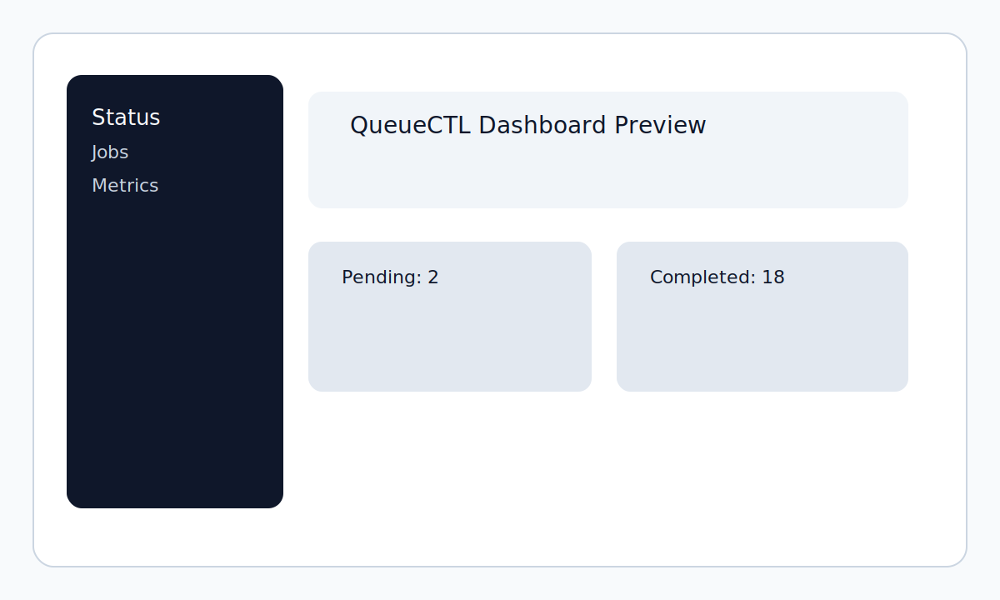

# User Guide

This guide is the product-facing documentation for QueueCTL. It walks a new user from installation through a first successful job run and introduces the CLI, dashboard, configuration, and common workflows.



## 1. What QueueCTL is

QueueCTL is a local-first background job queue for Node.js and TypeScript. It is designed for situations where you want a small, inspectable queue without bringing in a separate broker or hosted service.

In practice, QueueCTL is useful for:

- running shell-based background work locally
- keeping job state visible through a lightweight CLI
- inspecting recent outcomes through a simple dashboard
- learning how a job queue behaves without a large operational stack

## 2. Prerequisites

- Node.js 18 or newer
- npm

## 3. Installation

```bash
npm install
npm run build
npm link
```

The CLI entry point is registered as `queuectl` through the package bin mapping. You can also run the built entry point directly if needed.

## 4. Start QueueCTL

Open one terminal and run:

```bash
npm start
```

This starts:

- QueueCTL Daemon
- Dashboard Server

The dashboard is then accessible at:

```
http://localhost:3000
```

The daemon will:

- initialize the SQLite database
- create the local IPC socket
- start listening for CLI and dashboard requests

The socket path depends on the platform:

- Linux and macOS: `/tmp/queuectl.sock`
- Windows: `\\.\pipe\queuectl`

You can override the socket location with the `SOCKET_PATH` environment variable.

## 5. Quick start

### Step 1: enqueue a job

```bash
queuectl enqueue '{"id":"job1","command":"echo hello"}'
```

Expected output:

```text
✔ Job 'job1' enqueued.
```

### Step 2: start a worker

```bash
queuectl worker start --count 1
```

### Step 3: inspect the job

```bash
queuectl status
queuectl list --state completed
```

### Step 4: view runtime metrics

```bash
queuectl metrics
```

### Step 5: start the dashboard

Open

http://localhost:3000

or

https://flam-software-intern-project-production.up.railway.app

## 6. CLI reference

### Enqueue jobs

```bash
queuectl enqueue '{"id":"job1","command":"echo hello"}'
```

The CLI validates the payload before sending it to the daemon.

Supported fields:

| Field | Required | Description |
| --- | --- | --- |
| id | Yes | Unique identifier for the job |
| command | Yes | Shell command to execute |
| priority | No | `0` for normal or `1` for high |
| run_after | No | ISO timestamp used to delay execution |
| timeout | No | Per-job timeout in milliseconds |
| max_retries | No | Max retries for the job |

Example with a delayed run:

```bash
queuectl enqueue '{"id":"job2","command":"echo delayed","run_after":"2025-11-10T15:00:00Z"}'
```

### Check queue status

```bash
queuectl status
```

The status output includes the counts for:

- pending
- processing
- completed
- failed
- dead

and the current number of active workers.

### List jobs by state

```bash
queuectl list --state completed
```

The current implementation expects one of these states:

- pending
- processing
- completed
- failed
- dead

### Manage workers

Start workers:

```bash
queuectl worker start --count 3
```

Stop workers:

```bash
queuectl worker stop
```

The current implementation accepts worker counts from `1` to `128`.

### View metrics

```bash
queuectl metrics
```

The metrics view includes:

- total jobs
- completed jobs
- dead jobs
- retry count
- worker count
- success rate
- failure rate
- uptime
- total commands executed
- average runtime
- max runtime

### Use the dead-letter queue

List dead jobs:

```bash
queuectl dlq list
```

Retry a dead job:

```bash
queuectl dlq retry <jobId>
```

A dead job is moved back to the pending state and its attempt count is reset before it is eligible to run again.

### View or change configuration

Show the current configuration:

```bash
queuectl config show
```

Set a value:

```bash
queuectl config set max-retries 5
queuectl config set backoff exponential
queuectl config set delay-base 2000
queuectl config set timeout 10000
```

## 7. Dashboard usage

Start the dashboard with:

The dashboard starts automatically when running:

```bash
npm start
```

Default local URL:

```
http://localhost:8080
```

Hosted version:

```
https://flam-software-intern-project-production.up.railway.app
```

It listens on port `8080` by default and can be overridden with `PORT`.

The dashboard exposes these routes:

- `/health`
- `/api/status`
- `/api/jobs`
- `/api/metrics`

If the daemon is unavailable, the dashboard responds with a connection error instead of crashing.

## 8. Configuration reference

| Key | Accepted values | Default | Notes |
| --- | --- | --- | --- |
| max-retries | positive number | 3 | Maximum retries for a job |
| backoff | `fixed`, `exponential` | `exponential` | Retry strategy |
| delay-base | positive number (milliseconds) | 5000 | Base delay used for retries |
| timeout | positive number (milliseconds) | 5000 | Per-job execution timeout |

## 9. Environment variables

| Variable | Purpose |
| --- | --- |
| DB_PATH | Overrides the SQLite database path |
| SOCKET_PATH | Overrides the daemon IPC socket path |
| PORT | Overrides the dashboard port |

Example:

```bash
export DB_PATH=/path/to/queuectl.db
export SOCKET_PATH=/tmp/queuectl.sock
export PORT=4000
```

## 10. Job lifecycle

Jobs move through these states:

- pending
- processing
- completed
- failed
- dead

The typical flow is:

1. a job is enqueued as pending
2. a worker claims it and marks it processing
3. the worker runs the command
4. the job becomes completed, failed, or dead

A failed job may be retried after a delay. Once retries are exhausted it becomes dead.

## 11. Common workflows

### Basic end-to-end run

1. start the daemon
2. enqueue a job
3. start one worker
4. verify the state with `queuectl status`
5. inspect the job with `queuectl list --state completed`
6. review metrics with `queuectl metrics`

### Retry and DLQ workflow

1. configure a low retry limit
2. enqueue a job that fails
3. wait for the retry cycle to complete
4. inspect dead jobs with `queuectl dlq list`
5. retry a dead job with `queuectl dlq retry <jobId>`

## 12. Troubleshooting

### The daemon will not start

Check whether the socket path is already in use and whether the required port or pipe is available.

### The CLI reports an IPC connection error

Confirm that the daemon is running and that `SOCKET_PATH` points to the same location for the CLI and daemon.

### A job never completes

Check the job state, review the command, and confirm the worker is running.

## 13. FAQ

### Is QueueCTL production-grade?

It is a small local-first queue that is useful for development, automation, and learning. It is not a distributed broker replacement.

### Does it support remote workers?

No. The current implementation uses local child-process workers and a local socket.

### Is the dashboard required?

No. The dashboard is optional and exists to provide a simple UI for status, jobs, and metrics.

## 14. Verification flow

The current user guide mirrors the behavior exercised by the integration tests in [tests/scenarios.test.ts](tests/scenarios.test.ts).
